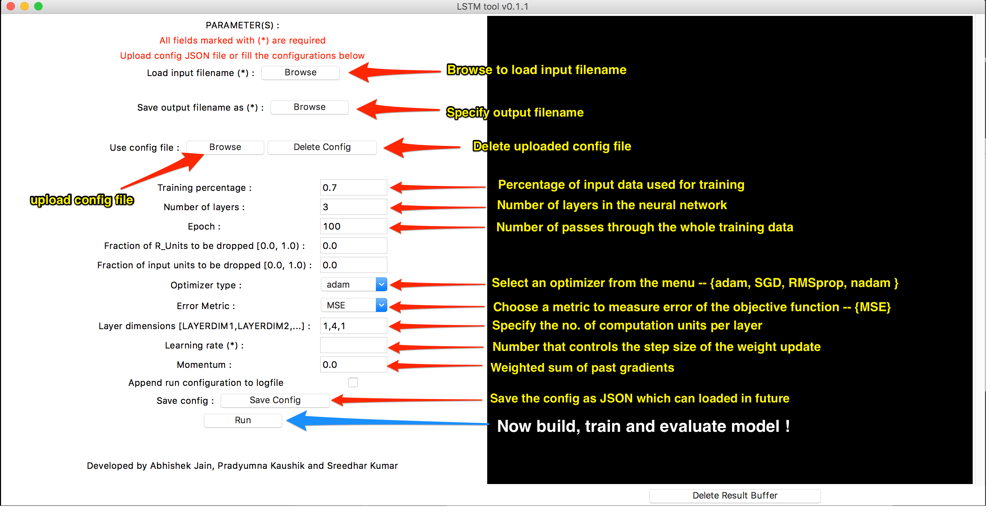
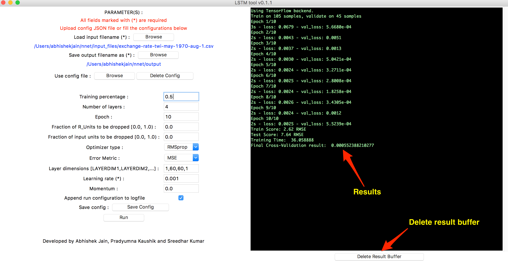

Command to run CLI
========================
```
python run.py --infile <input filename> --outfile <output filename> --learnrate <(0.0,1.0]>
```
Other command-line options are given below.


Configuration parameters as command-line options
================================================
- Specify the learning rate (default value is 0.01) -- \**required*.  

  	```
    --learnrate
    ```
    *Determines the step size of the weight update and is critical to the convergence of the algorithm to the global minima of the objective function. A very high learning rate might end up missing certain local minima. A very low learning will end up slowing down the learning process.*  

- Specify the number of layers in the neural network.  

  	```
    --nlayers
    ```
    *Number of layers depends on the number of features that need to be extracted from the data*.  

- Specify the dimensions of each layer in the neural network.  

  	```
    --layerdim
    ```
    *Number of computation units in each layer*.  

- Specify the fraction of RUnits that are dropped out (value is in range [0.0, 1.0).  

  	```
    --dropout_fraction_ru
    ```
    *Drop a fraction of recurrent connections that remember the past results. Dropping RUnits would reduce exposure to data and hence, prevent overfitting*.  

- Specify the fraction of input units that are dropped out (value is in range [0.0, 1.0).  

  	```
    --dropout_fraction_rw
    ```
    *Drop fraction of inputs from passing to the next layer in the network. This helps in being more robust to noise*.  

- Specify the optimizer.  

  	```
    --optimizer
    ```
    *There are currently three optimizers (Adam, SGD and RMSprop)*.  

- Specify the momentum.  

  	```
    --momentum
    ```
    *Weighted sum of past gradients that is used to accelerate learning and provide direction to the optimiser*.  

- Specify the training percent (The value is in range (0.0, 1.0]).  

  	```
    --trainpct
    ```
    *Percent of data to be used for training. The remaining would be used for testing and evaluation*.   

- Specify the error metric.  

  	```
    --errmetric
    ```  

- Specify the number of epochs.  

  	```
    --epoch
    ```
    *Number of passes through the whole training data*.   


Command-line options
====================
- Specify input filename (.csv) -- \**required*.  

  	```
    --infile
    ```
    *The input file currently needs to contain 1-dimensional data*.  

- Specify output filename -- \**required*.  

  	```
    --outfile
    ```  

- Specify a config JSON file as input.  

  	```
    --config
    ```
    *Can use this to provide a file containing a JSON with appropriate parameters as the configuration to run the neural network. If config file provided, then all configuration parameters specified (those specified above) on the command-line would be ignored*.  

	  *Example config JSON is shown below*,
	  ```
	  {  
		"n_layers": 4,  
		"dropout_fraction_ru": 0.1,  
		"dropout_fraction_rw": 0.1,  
		"layer_dimensions": [1, 60, 60, 1],  
		"optimizer": "adam",  
		"learning_rate": 0.001,  
		"momentum": 0.1,  
		"training_percent": 0.5,  
		"err_metric": "mean_squared_error",  
		"epoch": 10  
	  }
	  ```  

- Specify log filename (default logfile is <outputfile>\_log).  

  	```
    --logfile
    ```  

- Append the run configuration to the logfile.  

  	```
    --append
    ```


Command to run GUI
========================
```
python gui.py
```

GUI Guide -- Configuration Input
====================================


GUI Guide -- Results
===========================

